# 数据库实体关系图

## LLMOps 系统数据模型架构

这个 Mermaid ERD 展示了 LLMOps 系统中各个实体之间的关系。

```mermaid
erDiagram
    %% 核心账号和身份验证
    Account {
        UUID id PK
        string name
        string email
        string avatar
        string password
        string password_salt
        UUID assistant_agent_conversation_id FK
        datetime last_login_at
        string last_login_ip
        datetime updated_at
        datetime created_at
    }
    
    AccountOAuth {
        UUID id PK
        UUID account_id FK
        string provider
        string openid
        string encrypted_token
        datetime updated_at
        datetime created_at
    }
    
    ApiKey {
        UUID id PK
        UUID account_id FK
        string api_key
        boolean is_active
        string remark
        datetime updated_at
        datetime created_at
    }
    
    %% 应用和配置
    App {
        UUID id PK
        UUID account_id FK
        UUID app_config_id FK
        UUID draft_app_config_id FK
        UUID debug_conversation_id FK
        string name
        string icon
        text description
        string token
        string status
        datetime updated_at
        datetime created_at
    }
    
    AppConfig {
        UUID id PK
        UUID app_id FK
        jsonb model_config
        integer dialog_round
        text preset_prompt
        jsonb tools
        jsonb workflows
        jsonb retrieval_config
        jsonb long_term_memory
        text opening_statement
        jsonb opening_questions
        jsonb speech_to_text
        jsonb text_to_speech
        jsonb suggested_after_answer
        jsonb review_config
        datetime updated_at
        datetime created_at
    }
    
    AppConfigVersion {
        UUID id PK
        UUID app_id FK
        jsonb model_config
        integer dialog_round
        text preset_prompt
        jsonb tools
        jsonb workflows
        jsonb datasets
        jsonb retrieval_config
        jsonb long_term_memory
        text opening_statement
        jsonb opening_questions
        jsonb speech_to_text
        jsonb text_to_speech
        jsonb suggested_after_answer
        jsonb review_config
        integer version
        string config_type
        datetime updated_at
        datetime created_at
    }
    
    AppDatasetJoin {
        UUID id PK
        UUID app_id FK
        UUID dataset_id FK
        datetime updated_at
        datetime created_at
    }
    
    %% 对话和消息
    Conversation {
        UUID id PK
        UUID app_id FK
        string name
        text inputs
        text introduction
        text system_instruction
        integer system_instruction_tokens
        string status
        string invoke_from
        UUID created_by FK
        datetime updated_at
        datetime created_at
    }
    
    Message {
        UUID id PK
        UUID app_id FK
        UUID conversation_id FK
        string inputs
        string query
        text message
        text message_tokens
        integer message_unit_price
        text answer
        integer answer_tokens
        integer answer_unit_price
        string provider_response_latency
        string from_source
        string from_end_user_id
        string from_account_id
        datetime updated_at
        datetime created_at
    }
    
    MessageAgentThought {
        UUID id PK
        UUID app_id FK
        UUID conversation_id FK
        UUID message_id FK
        integer position
        string thought
        jsonb tool
        string tool_input
        string observation
        integer tool_process_data_id
        string tool_process_data_from
        datetime updated_at
        datetime created_at
    }
    
    %% 知识库相关
    Dataset {
        UUID id PK
        UUID account_id FK
        string name
        text description
        string provider
        jsonb permission
        jsonb data_source_type
        jsonb indexing_technique
        string index_struct
        datetime updated_at
        datetime created_at
    }
    
    Document {
        UUID id PK
        UUID account_id FK
        UUID dataset_id FK
        UUID upload_file_id FK
        UUID process_rule_id FK
        integer position
        string data_source_type
        jsonb data_source_info
        jsonb dataset_process_rule_id
        string batch
        string name
        datetime updated_at
        datetime created_at
    }
    
    Segment {
        UUID id PK
        UUID account_id FK
        UUID dataset_id FK
        UUID document_id FK
        UUID node_id FK
        integer position
        text content
        integer word_count
        integer tokens
        jsonb keywords
        string index_node_id
        string index_node_hash
        string hit_count
        string enabled
        string disabled_at
        string disabled_by
        string status
        datetime updated_at
        datetime created_at
    }
    
    KeywordTable {
        UUID id PK
        UUID dataset_id FK
        string keyword_table
        datetime updated_at
        datetime created_at
    }
    
    DatasetQuery {
        UUID id PK
        UUID dataset_id FK
        text content
        UUID source_app_id FK
        datetime updated_at
        datetime created_at
    }
    
    ProcessRule {
        UUID id PK
        UUID account_id FK
        UUID dataset_id FK
        jsonb mode
        jsonb rules
        datetime updated_at
        datetime created_at
    }
    
    %% 工具相关
    ApiToolProvider {
        UUID id PK
        UUID account_id FK
        string name
        string icon
        text description
        text openapi_schema
        jsonb headers
        datetime updated_at
        datetime created_at
    }
    
    ApiTool {
        UUID id PK
        UUID account_id FK
        UUID provider_id FK
        string name
        text description
        string url
        string method
        jsonb parameters
        datetime updated_at
        datetime created_at
    }
    
    %% 工作流
    Workflow {
        UUID id PK
        UUID account_id FK
        string name
        text description
        jsonb graph
        jsonb features
        datetime updated_at
        datetime created_at
    }
    
    WorkflowResult {
        UUID id PK
        UUID app_id FK
        UUID account_id FK
        UUID workflow_id FK
        text inputs
        text outputs
        string status
        integer elapsed_time
        integer total_tokens
        string file_list
        datetime updated_at
        datetime created_at
    }
    
    %% 文件和用户
    UploadFile {
        UUID id PK
        UUID account_id FK
        string name
        string key
        integer size
        string extension
        string mime_type
        string hash
        datetime updated_at
        datetime created_at
    }
    
    EndUser {
        UUID id PK
        UUID tenant_id FK
        UUID app_id FK
        datetime updated_at
        datetime created_at
    }
    
    %% 关系定义
    Account ||--o{ AccountOAuth : "has"
    Account ||--o{ ApiKey : "owns"
    Account ||--o{ App : "creates"
    Account ||--o{ Dataset : "creates"
    Account ||--o{ ApiToolProvider : "creates"
    Account ||--o{ Workflow : "creates"
    Account ||--o{ UploadFile : "uploads"
    Account ||--o{ ProcessRule : "creates"
    Account ||--o{ Conversation : "creates"
    
    App ||--o| AppConfig : "has_published_config"
    App ||--o{ AppConfigVersion : "has_versions"
    App ||--o{ AppDatasetJoin : "links_to_datasets"
    App ||--o{ Conversation : "has_conversations"
    App ||--o{ Message : "contains_messages"
    App ||--o{ EndUser : "serves"
    App ||--o{ WorkflowResult : "executes_workflows"
    App ||--o{ DatasetQuery : "queries_datasets"
    
    Dataset ||--o{ Document : "contains"
    Dataset ||--o{ Segment : "has_segments"
    Dataset ||--o{ KeywordTable : "has_keyword_table"
    Dataset ||--o{ AppDatasetJoin : "linked_by_apps"
    Dataset ||--o{ DatasetQuery : "receives_queries"
    Dataset ||--o{ ProcessRule : "has_rules"
    
    Document ||--o{ Segment : "split_into"
    Document ||--|| UploadFile : "based_on"
    Document ||--|| ProcessRule : "processed_by"
    
    Conversation ||--o{ Message : "contains"
    Message ||--o{ MessageAgentThought : "has_thoughts"
    
    ApiToolProvider ||--o{ ApiTool : "provides"
    
    Workflow ||--o{ WorkflowResult : "generates_results"
    
    %% 自引用关系
    Account ||--o| Conversation : "assistant_conversation"
    App ||--o| Conversation : "debug_conversation"
```

## 核心实体说明

### 账号管理模块
- **Account**: 用户账号主表，包含基本信息和认证数据
- **AccountOAuth**: 第三方登录授权信息
- **ApiKey**: API密钥管理

### 应用管理模块
- **App**: AI应用主表
- **AppConfig**: 应用的运行时配置
- **AppConfigVersion**: 应用配置的版本管理（草稿+历史）
- **AppDatasetJoin**: 应用与知识库的关联表

### 对话管理模块
- **Conversation**: 对话会话管理
- **Message**: 消息记录
- **MessageAgentThought**: Agent思考过程记录

### 知识库模块
- **Dataset**: 知识库主表
- **Document**: 文档管理
- **Segment**: 文档分片
- **KeywordTable**: 关键词表
- **DatasetQuery**: 查询记录
- **ProcessRule**: 处理规则

### 工具模块
- **ApiToolProvider**: API工具提供者
- **ApiTool**: 具体的API工具

### 工作流模块
- **Workflow**: 工作流定义
- **WorkflowResult**: 工作流执行结果

### 其他模块
- **UploadFile**: 文件上传管理
- **EndUser**: 终端用户管理

## 关键关系说明

1. **Account** 是系统的核心，与大部分实体都有创建关系
2. **App** 通过 **AppDatasetJoin** 与 **Dataset** 建立多对多关系
3. **Document** 基于 **UploadFile** 创建，并按照 **ProcessRule** 处理
4. **Conversation** 和 **Message** 形成一对多关系，支持完整的对话管理
5. **Dataset** 通过 **Document** 和 **Segment** 实现分层的内容管理
